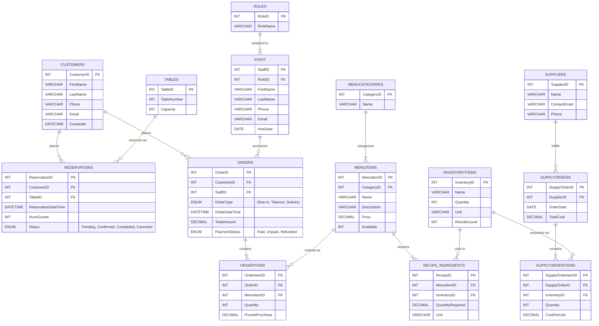

```mermaid
erDiagram
    %% ---------------------------------------------------------
    %% 1. FRONT OF HOUSE (FOH) & CUSTOMERS
    %% ---------------------------------------------------------
    CUSTOMERS {
        INT CustomerID PK
        VARCHAR FirstName
        VARCHAR LastName
        VARCHAR Phone
        VARCHAR Email
        DATETIME CreatedAt
    }

    RESERVATIONS {
        INT ReservationID PK
        INT CustomerID FK
        INT TableID FK
        DATETIME ReservationDateTime
        INT NumGuests
        ENUM Status "Pending, Confirmed, Completed, Canceled"
    }

    TABLES {
        INT TableID PK
        INT TableNumber
        INT Capacity
    }

    ORDERS {
        INT OrderID PK
        INT CustomerID FK
        INT StaffID FK
        ENUM OrderType "Dine-In, Takeout, Delivery"
        DATETIME OrderDateTime
        DECIMAL TotalAmount
        ENUM PaymentStatus "Paid, Unpaid, Refunded"
    }

    ORDERITEMS {
        INT OrderItemID PK
        INT OrderID FK
        INT MenuItemID FK
        INT Quantity
        DECIMAL PriceAtPurchase
    }

    %% ---------------------------------------------------------
    %% 2. MENU & RECIPE BRIDGE
    %% ---------------------------------------------------------
    MENUCATEGORIES {
        INT CategoryID PK
        VARCHAR Name
    }

    MENUITEMS {
        INT MenuItemID PK
        INT CategoryID FK
        VARCHAR Name
        VARCHAR Description
        DECIMAL Price
        BIT Available
    }

    %% THE BRIDGE: Links Menu Items to Inventory Items
    RECIPE_INGREDIENTS {
        INT RecipeID PK
        INT MenuItemID FK
        INT InventoryID FK
        DECIMAL QuantityRequired
        VARCHAR Unit
    }

    %% ---------------------------------------------------------
    %% 3. STAFF MANAGEMENT
    %% ---------------------------------------------------------
    ROLES {
        INT RoleID PK
        VARCHAR RoleName
    }

    STAFF {
        INT StaffID PK
        INT RoleID FK
        VARCHAR FirstName
        VARCHAR LastName
        VARCHAR Phone
        VARCHAR Email
        DATE HireDate
    }

    %% ---------------------------------------------------------
    %% 4. BACK OF HOUSE (BOH) & SUPPLY CHAIN
    %% ---------------------------------------------------------
    INVENTORYITEMS {
        INT InventoryID PK
        VARCHAR Name
        INT Quantity
        VARCHAR Unit
        INT ReorderLevel
    }

    SUPPLIERS {
        INT SupplierID PK
        VARCHAR Name
        VARCHAR ContactEmail
        VARCHAR Phone
    }

    SUPPLYORDERS {
        INT SupplyOrderID PK
        INT SupplierID FK
        DATE OrderDate
        DECIMAL TotalCost
    }

    SUPPLYORDERITEMS {
        INT SupplyOrderItemID PK
        INT SupplyOrderID FK
        INT InventoryID FK
        INT Quantity
        DECIMAL CostPerUnit
    }

    %% =========================================================
    %% RELATIONSHIPS
    %% =========================================================

    %% --- FOH Relationships ---
    CUSTOMERS ||--o{ RESERVATIONS : "places"
    CUSTOMERS ||--o{ ORDERS : "places"
    TABLES ||--o{ RESERVATIONS : "reserved via"
    STAFF ||--o{ ORDERS : "processes"
    ORDERS ||--|{ ORDERITEMS : "contains"
    
    %% --- Menu & Recipe Relationships (THE NEW CONNECTIONS) ---
    MENUCATEGORIES ||--|{ MENUITEMS : "categorizes"
    MENUITEMS ||--o{ ORDERITEMS : "ordered as"
    MENUITEMS ||--|{ RECIPE_INGREDIENTS : "requires"
    INVENTORYITEMS ||--o{ RECIPE_INGREDIENTS : "used in"

    %% --- Staff Relationships ---
    ROLES ||--|{ STAFF : "assigned to"

    %% --- BOH Relationships ---
    SUPPLIERS ||--o{ SUPPLYORDERS : "fulfills"
    SUPPLYORDERS ||--|{ SUPPLYORDERITEMS : "contains"
    INVENTORYITEMS ||--o{ SUPPLYORDERITEMS : "restocked via"
```